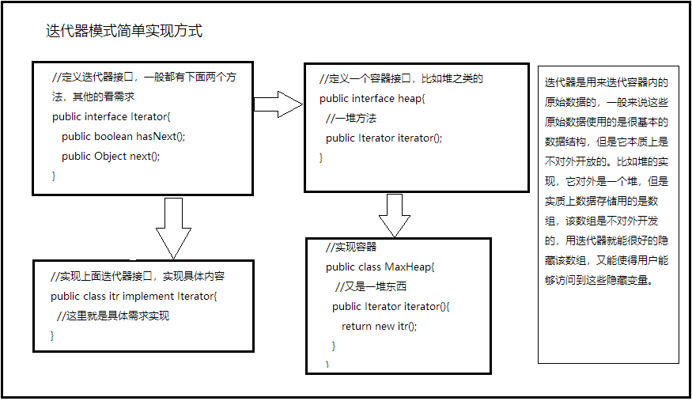

### 图论，详细概念请翻阅相关书籍进行系统学习
+ 无向图
+ 有向图
+ 无权图
+ 有权图
### 简单图（无向无权，没有自环和平行边的图）
+ 用邻接矩阵(Adjacency Matrix)表示节点与节点间的关系
	* 适合表示稠密图(Dense Graph)
	* 邻接矩阵用boolean值来说明是否两个节点有边，不自觉的就把平行边以及有权边给去除了
+ 用邻接表(Adjacency Lists)表示节点与节点之间的关系
	* 适合表示稀疏图(Sparse Graph)，占用内存较少
	* 每一个节点都用一行来表示，行内只存储与自身相连的节点信息，就能大大节约存储空间
+ 遍历图
	* 迭代器实现图遍历
		+ 迭代器模式：就是提供一种方法对一个容器对象中的各个元素进行访问，而又不暴露该对象容器的内部细节，一般迭代器模式实现有4个部分组成
			* (1)定义一个迭代器接口
			* (2)实现迭代器接口，实现一个具体的迭代器
			* (3)定义一个容器接口，里面有一个得到迭代器接口的方法
			* (4)实现容器接口，实现一个具体的容器
			* 
		+ 容器一般指的是具有某种数据结构的对象数据集合，一般java中集合框架也称之为容器
		+ 迭代器遍历容器的最大好处就是通过访问逻辑，把容器内部数据暴露出来了，但是不暴露内部结构，避免了用户得到内部数据不小心修改了，导致容器结构出现问题的情况
	* 遍历存储数据（遍历边）
		+ 遍历边数据就是直接遍历存储的数据
	* 深度优先遍历（遍历节点）
		+ 以存储的边的数据遍历节点
			* 先随机找一个点，从该点开始，遍历所有与它连接的点
			* 深度优先体现在，先以A为根，遍历到B点与A点相连，再以B为根，遍历到C...最后没有了，再回传到B，遍历B的另一个相连节点，再往下...最后又回传到A
			* 与树的遍历差不多，也是用递归的思想实现
			* 不同的要记录遍历到的点，避免重复遍历
		+ 连通分量问题。每次以某个节点为根进行遍历，不在同一个连通分量的节点就不会被遍历到，深度优先的遍历方法还可以帮助记录连通分量的问题。
		+ 相互连接问题。根据连通分量给每个节点赋值一个id。同一个id表示在同一个连通分量中，那么就是相互连接的，就可以判断两个节点是否连接的问题
		+ 路径问题。按深度优先遍历的方法寻找点到点的路径，需要维护一个新的from数组，from[p]记录的是遍历p节点前的节点
	* 广度优先遍历
		+ 也要使用队列这种结构进行辅助遍历
		+ 同样从存储的边数据中遍历节点
			* 确定开始遍历的点
			* 广度优先遍历同遍历树结构时其实是一样的，都是先把儿子进队列，在出队时遍历出队的节点的儿子，进队...
			* 同样使用一个visited数组记录遍历过的节点
		+ 最短路径问题。广度优先遍历的过程其实是按照离初始节点的距离一层层遍历的，所以天然具有最短路径的说法（无权图）。所以只要在遍历的时候给遍历的每个节点记录一个距离就能找到最短路径。
		+ 当然同深度遍历一样，寻找点到点的路径，需要维护一个新的from数组，from[p]记录的是遍历p节点前的节点，这样通过回溯就可以找到路径