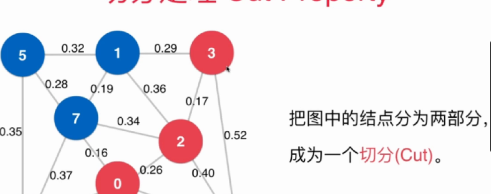
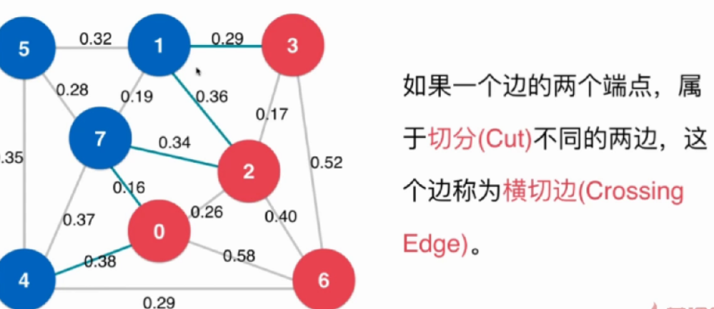
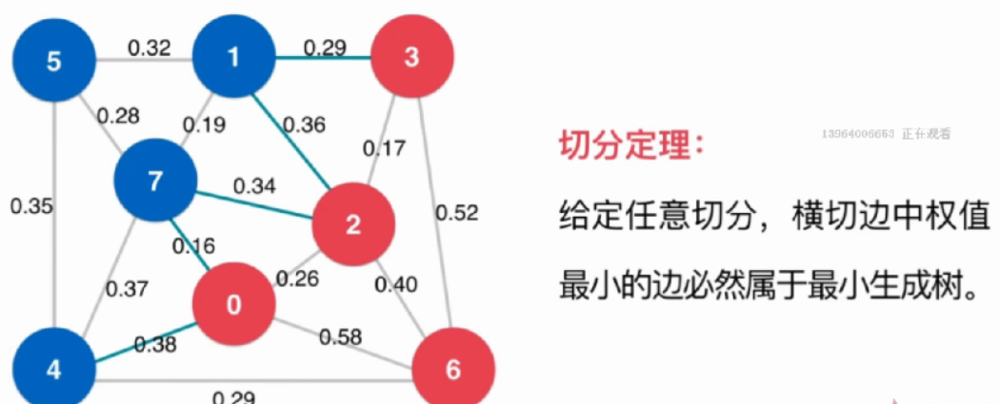

### 最小生成树问题（带权无向图，连通图）
	* 最小生成树即在有n个节点的连通有权图中，只使用其中(n-1)条边使得所有节点连接起来，并且边的权值总和最小，就是一个连通图的最小生成树。
		+ 连接n个节点
		+ 使用(n-1)条边
		+ 总权值最小
	* 应用（主要应用于各节点的连通设计）
		+ 电缆布线设计
		+ 网络设计
		+ 电路设计
	* 切分定理
		+ 切分：把顶点分成两部分
		
		+ 横切边：顶点分开的两部分相连的边
		
		+ 切分定理：任意切分中，横切边最小值一定是最小生成树中的一条边.大概说明一下。一次切分会把整个图分成两个部分，由于最小生成树中要求连接所有节点，那么分成的两部分最少也要有一条边进行连接，所以选取最小边就是最优方案
		
	* Lazy Prim算法
		