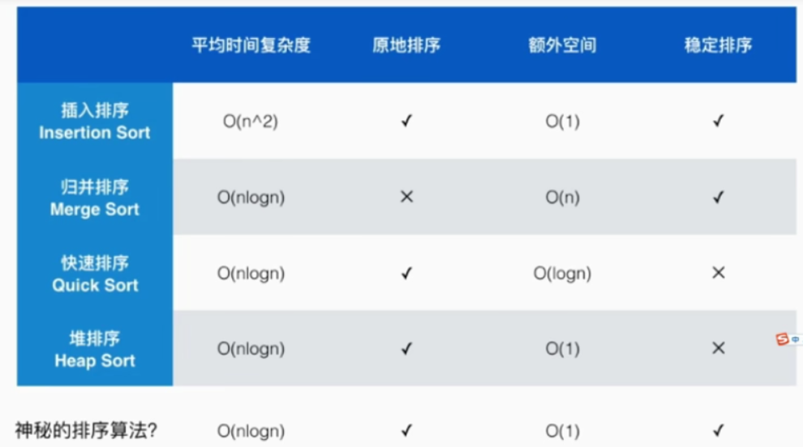

### 特别说明：
* 大部分情况下每种排序算法都有两种实现形式  
都会以doSort1/doSort2分开表示
* 经过测试，都是第2种效率更高
* 两种对比是为了帮助更好理解算法的核心本质
	
+ 这里用于排序算法测试的都是数组
+ 其他不同数据结构的算法实现的差异不做讨论
+ 这里主要是讨论算法思想

### 排序算法的稳定性
* 主要指的是待排序的元素中，相等的元素相对位置问题
	+ 当排序后相等元素的相对位置没有改变，则该排序算法是稳定的
	+ 当排序后相等元素的相对位置会改变，则该排序算法是不稳定的
	+ 在自定义的比较器中，一般来说是不存在稳定性的问题的，因为使用自定义的比较器比较的对象一般是不同的
	
### 算法总结
