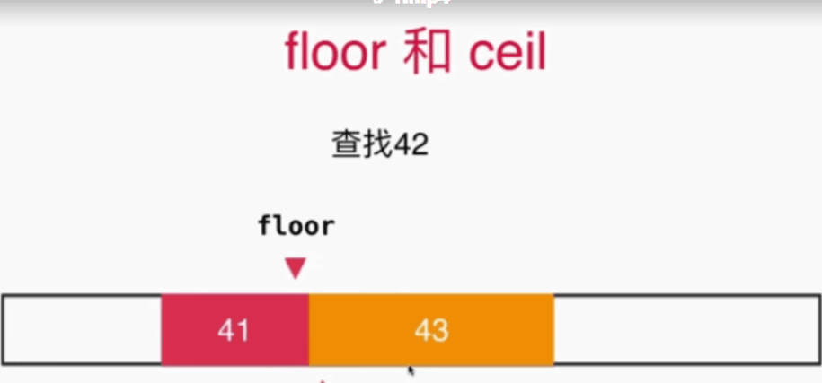
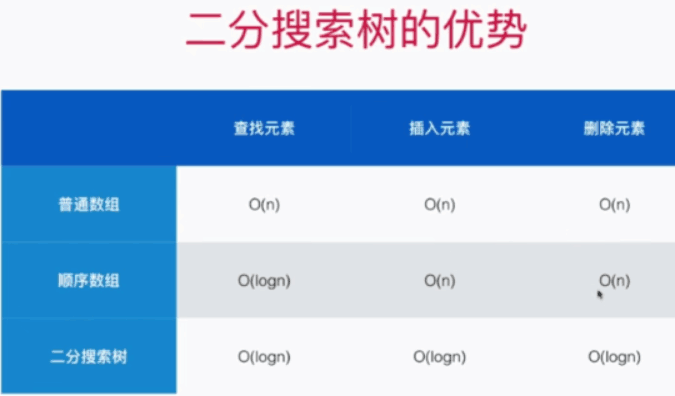

### 二叉搜索树(binary search tree)
+ 主要应用于查找问题  
	* 二分查找法(适用于有序序列)   
	* 循环和递归两种实现方式，还有floor/ceil函数的作用  
	  
+ 二分搜索树是指一种二叉树的数据结构，它有以下一些特点    
	* 每个节点大于左儿子，小于右儿子  
	* 以左右节点作为根节点也是新的二分搜索树  
	* 区别于堆的完全二叉树结构，它不一定是一个完全二叉树  
	* 优点（方便回答很多数据之间的关系问题）  
		+ 根据key值可以快速查找数据，时间复杂度(O(logn))  
		+ 快速找到最值（max/min）  
		+ floor/ceil函数  
		+ rank    
	* 深度优先遍历  
		+ 前序遍历  
		+ 中序遍历（相当于排序）  
		+ 后序遍历（清空树操作）  
	* 广度优先遍历  
		+ 层序遍历  
